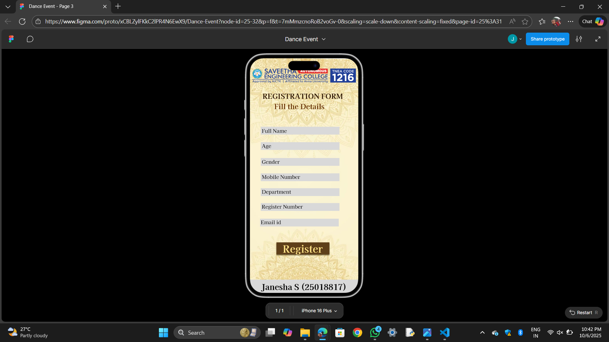

# Ex09 Event Registration Web Application
## Date: 06.10.2025

## AIM:
To design, develop and deploy a web application for event registration.

## DESIGN STEPS:

### Step 1:
Create a new frame.

### Step 2:
Select any one preset size of your choice.

### Step 3:
Select the shapes you need.

### Step 4:
Import images as needed.

### Step 5:
Create pages based on your need and link them.

### Step 6:

Validate the HTML and CSS code.

### Step 6:

Publish the website in the given URL.

## DESIGN TOOL:
Figma

## CODE:
```
Page 1

index.html
<!DOCTYPE html>
<html>
  <head>
    <meta name="viewport" content="width=device-width, initial-scale=1" />
    <meta charset="utf-8" />
    <link rel="stylesheet" href="globals.css" />
    <link rel="stylesheet" href="style.css" />
  </head>
  <body>
    <div class="android-compact">
      
      
      <div class="rectangle"></div>
      <div class="text-wrapper">Register</div>
      <div class="div"></div>
      <div class="text-wrapper-2">Log in</div>
      <div class="CULTURAL-DANCE-EVENT">&nbsp;&nbsp;&nbsp;&nbsp;CULTURAL <br />DANCE EVENT</div>
      <div class="rectangle-2"></div>
      <div class="text-wrapper-3">Janesha S (25018817)</div>
    </div>
  </body>
</html>
globals.css
@import url("https://cdnjs.cloudflare.com/ajax/libs/meyer-reset/2.0/reset.min.css");
* {
  -webkit-font-smoothing: antialiased;
  box-sizing: border-box;
}
html,
body {
  margin: 0px;
  height: 100%;
}
/* a blue color as a generic focus style */
button:focus-visible {
  outline: 2px solid #4a90e2 !important;
  outline: -webkit-focus-ring-color auto 5px !important;
}
a {
  text-decoration: none;
}
style.css
.android-compact {
  background-color: #ffffff;
  width: 100%;
  min-width: 430px;
  min-height: 932px;
  position: relative;
}

.android-compact .home {
  position: absolute;
  top: 0;
  left: 0;
  width: 430px;
  height: 932px;
  aspect-ratio: 0.56;
  object-fit: cover;
}

.android-compact .logo {
  position: absolute;
  top: 70px;
  left: 4px;
  width: 422px;
  height: 63px;
  aspect-ratio: 6.65;
  object-fit: cover;
}

.android-compact .rectangle {
  position: absolute;
  top: 418px;
  left: 105px;
  width: 220px;
  height: 63px;
  background-color: #d4a14f;
  box-shadow:
    0px 4px 4px #00000040, 0px 4px 4px #00000040, 0px 4px 4px #00000040, 0px 4px 4px #00000040, 0px 4px 4px #00000040, 0px 4px 4px #cd070791, 0px 4px 4px #00000040;
}

.android-compact .text-wrapper {
  position: absolute;
  top: 418px;
  left: 138px;
  font-family: "Jacques Francois-Regular", Helvetica;
  font-weight: 400;
  color: #510000;
  font-size: 40px;
  letter-spacing: 0;
  line-height: normal;
}

.android-compact .div {
  position: absolute;
  top: 542px;
  left: 105px;
  width: 220px;
  height: 63px;
  background-color: #d5a14f;
  box-shadow: 0px 4px 4px #00000040, 0px 4px 4px #ce070740, 0px 4px 4px
    #ce070791, 0px 4px 4px #00000080;
}

.android-compact .text-wrapper-2 {
  position: absolute;
  top: 547px;
  left: 154px;
  font-family: "Jacques Francois-Regular", Helvetica;
  font-weight: 400;
  color: #510000;
  font-size: 40px;
  letter-spacing: 0;
  line-height: normal;
}

.android-compact .CULTURAL-DANCE-EVENT {
  position: absolute;
  top: 253px;
  left: calc(50.00% - 137px);
  font-family: "Kaisei Tokumin-Bold", Helvetica;
  font-weight: 700;
  color: #893b00;
  font-size: 36px;
  letter-spacing: 0;
  line-height: normal;
}

.android-compact .rectangle-2 {
  position: absolute;
  top: 879px;
  left: 0;
  width: 430px;
  height: 53px;
  background-color: #d9d9d9;
}

.android-compact .text-wrapper-3 {
  position: absolute;
  top: 879px;
  left: 45px;
  width: 340px;
  font-family: "Kaisei Decol-Bold", Helvetica;
  font-weight: 700;
  color: #000000;
  font-size: 32px;
  letter-spacing: 0;
  line-height: normal;
}

Page 2

index.html
<!DOCTYPE html>
<html>
  <head>
    <meta name="viewport" content="width=device-width, initial-scale=1" />
    <meta charset="utf-8" />
    <link rel="stylesheet" href="globals.css" />
    <link rel="stylesheet" href="style.css" />
  </head>
  <body>
    <div class="android-compact">
      
      <div class="rectangle"></div>
      <div class="div"></div>
      <div class="rectangle-2"></div>
      <div class="rectangle-3"></div>
      <div class="rectangle-4"></div>
      <div class="text-wrapper">Bharatanatyam</div>
      <div class="text-wrapper-2">Kathak</div>
      <div class="text-wrapper-3">Kathakali</div>
      <div class="text-wrapper-4">Odissi</div>
      <div class="text-wrapper-5">Kuchipudi</div>
      <div class="text-wrapper-6">Choose a Dance Style</div>
      
      <div class="rectangle-5"></div>
      <div class="text-wrapper-7">Janesha S (25018817)</div>
    </div>
  </body>
</html>
globals.css
<!DOCTYPE html>
<html>
  <head>
    <meta name="viewport" content="width=device-width, initial-scale=1" />
    <meta charset="utf-8" />
    <link rel="stylesheet" href="globals.css" />
    <link rel="stylesheet" href="style.css" />
  </head>
  <body>
    <div class="android-compact">
      
      <div class="rectangle"></div>
      <div class="div"></div>
      <div class="rectangle-2"></div>
      <div class="rectangle-3"></div>
      <div class="rectangle-4"></div>
      <div class="text-wrapper">Bharatanatyam</div>
      <div class="text-wrapper-2">Kathak</div>
      <div class="text-wrapper-3">Kathakali</div>
      <div class="text-wrapper-4">Odissi</div>
      <div class="text-wrapper-5">Kuchipudi</div>
      <div class="text-wrapper-6">Choose a Dance Style</div>
      
      <div class="rectangle-5"></div>
      <div class="text-wrapper-7">Janesha S (25018817)</div>
    </div>
  </body>
</html>
style.css
.android-compact {
  background-color: #ffffff;
  overflow: hidden;
  width: 100%;
  min-width: 430px;
  min-height: 932px;
  position: relative;
}

.android-compact .dance {
  position: absolute;
  top: 0;
  left: 0;
  width: 430px;
  height: 932px;
  aspect-ratio: 0.56;
  object-fit: cover;
}

.android-compact .rectangle {
  position: absolute;
  top: 226px;
  left: 19px;
  width: 154px;
  height: 46px;
  background-color: #d2b380;
  box-shadow: 0px 4px 4px #482500cc;
}

.android-compact .div {
  position: absolute;
  top: 375px;
  left: 67px;
  width: 296px;
  height: 46px;
  background-color: #d2b380;
  box-shadow: 0px 4px 4px #482500cc;
}

.android-compact .rectangle-2 {
  position: absolute;
  top: 226px;
  left: 255px;
  width: 154px;
  height: 46px;
  background-color: #d2b380;
  box-shadow: 0px 4px 4px #482500cc;
}

.android-compact .rectangle-3 {
  position: absolute;
  top: 303px;
  left: 19px;
  width: 154px;
  height: 46px;
  background-color: #d2b380;
  box-shadow: 0px 4px 4px #482500cc;
}

.android-compact .rectangle-4 {
  position: absolute;
  top: 301px;
  left: 255px;
  width: 154px;
  height: 46px;
  background-color: #d2b380;
  box-shadow: 0px 4px 4px #482500cc;
}

.android-compact .text-wrapper {
  position: absolute;
  top: 375px;
  left: 98px;
  font-family: "Kaisei Tokumin-Bold", Helvetica;
  font-weight: 700;
  color: #482500;
  font-size: 32px;
  letter-spacing: 0;
  line-height: normal;
}

.android-compact .text-wrapper-2 {
  position: absolute;
  top: 226px;
  left: 41px;
  font-family: "Kaisei Tokumin-Bold", Helvetica;
  font-weight: 700;
  color: #482500;
  font-size: 32px;
  letter-spacing: 0;
  line-height: normal;
}

.android-compact .text-wrapper-3 {
  position: absolute;
  top: 303px;
  left: 273px;
  width: 186px;
  font-family: "Kaisei Tokumin-Bold", Helvetica;
  font-weight: 700;
  color: #482500;
  font-size: 28px;
  letter-spacing: 0;
  line-height: normal;
}

.android-compact .text-wrapper-4 {
  position: absolute;
  top: 226px;
  left: 285px;
  font-family: "Kaisei Tokumin-Bold", Helvetica;
  font-weight: 700;
  color: #482500;
  font-size: 32px;
  letter-spacing: 0;
  line-height: normal;
}

.android-compact .text-wrapper-5 {
  position: absolute;
  top: 303px;
  left: 25px;
  font-family: "Kaisei Tokumin-Bold", Helvetica;
  font-weight: 700;
  color: #482500;
  font-size: 28px;
  letter-spacing: 0;
  line-height: normal;
}

.android-compact .text-wrapper-6 {
  position: absolute;
  top: 149px;
  left: 48px;
  font-family: "Kaisei Tokumin-Bold", Helvetica;
  font-weight: 700;
  color: #280000;
  font-size: 32px;
  letter-spacing: 0;
  line-height: normal;
}

.android-compact .logo {
  position: absolute;
  top: 44px;
  left: 3px;
  width: 423px;
  height: 64px;
  aspect-ratio: 6.65;
  object-fit: cover;
}

.android-compact .rectangle-5 {
  position: absolute;
  top: 882px;
  left: 0;
  width: 430px;
  height: 50px;
  background-color: #d9d9d9;
}

.android-compact .text-wrapper-7 {
  position: absolute;
  top: 882px;
  left: 48px;
  font-family: "Kaisei Decol-Bold", Helvetica;
  font-weight: 700;
  color: #000000;
  font-size: 32px;
  letter-spacing: 0;
  line-height: normal;
}

Page 3

index.html
<!DOCTYPE html>
<html>
  <head>
    <meta name="viewport" content="width=device-width, initial-scale=1" />
    <meta charset="utf-8" />
    <link rel="stylesheet" href="globals.css" />
    <link rel="stylesheet" href="style.css" />
  </head>
  <body>
    <div class="android-compact">
      
      <div class="text-wrapper">REGISTRATION FORM</div>
      <div class="div">Fill the Details</div>
      <div class="rectangle"></div>
      <div class="rectangle-2"></div>
      <div class="rectangle-3"></div>
      <div class="rectangle-4"></div>
      <div class="rectangle-5"></div>
      <div class="rectangle-6"></div>
      <div class="rectangle-7"></div>
      <div class="rectangle-8"></div>
      <div class="text-wrapper-2">Gender</div>
      <div class="text-wrapper-3">Age</div>
      <div class="text-wrapper-4">Department</div>
      <div class="text-wrapper-5">Mobile Number</div>
      <div class="text-wrapper-6">Email id</div>
      <div class="text-wrapper-7">Register Number</div>
      <div class="text-wrapper-8">Full Name</div>
      <div class="text-wrapper-9">Register</div>
      <div class="rectangle-9"></div>
      <div class="text-wrapper-10">Janesha S (25018817)</div>
      
    </div>
  </body>
</html>
globals.css
@import url("https://cdnjs.cloudflare.com/ajax/libs/meyer-reset/2.0/reset.min.css");
* {
  -webkit-font-smoothing: antialiased;
  box-sizing: border-box;
}
html,
body {
  margin: 0px;
  height: 100%;
}
/* a blue color as a generic focus style */
button:focus-visible {
  outline: 2px solid #4a90e2 !important;
  outline: -webkit-focus-ring-color auto 5px !important;
}
a {
  text-decoration: none;
}
style.css
.android-compact {
  background-color: #ffffff;
  width: 100%;
  min-width: 430px;
  min-height: 932px;
  position: relative;
}

.android-compact .register {
  position: absolute;
  top: 0;
  left: 0;
  width: 430px;
  height: 932px;
  aspect-ratio: 0.56;
  object-fit: cover;
}

.android-compact .text-wrapper {
  position: absolute;
  top: 128px;
  left: 50px;
  font-family: "Kaisei Tokumin-Bold", Helvetica;
  font-weight: 700;
  color: #2b1400;
  font-size: 28px;
  letter-spacing: 0;
  line-height: normal;
}

.android-compact .div {
  position: absolute;
  top: 169px;
  left: 96px;
  font-family: "Kaisei Tokumin-Bold", Helvetica;
  font-weight: 700;
  color: #652f00;
  font-size: 28px;
  letter-spacing: 0;
  line-height: normal;
}

.android-compact .rectangle {
  position: absolute;
  top: 272px;
  left: 43px;
  width: 312px;
  height: 31px;
  background-color: #d9d9d9;
}

.android-compact .rectangle-2 {
  position: absolute;
  top: 516px;
  left: 43px;
  width: 312px;
  height: 31px;
  background-color: #d9d9d9;
}

.android-compact .rectangle-3 {
  position: absolute;
  top: 575px;
  left: 43px;
  width: 312px;
  height: 31px;
  background-color: #d9d9d9;
}

.android-compact .rectangle-4 {
  position: absolute;
  top: 637px;
  left: 40px;
  width: 312px;
  height: 31px;
  background-color: #d9d9d9;
}

.android-compact .rectangle-5 {
  position: absolute;
  top: 457px;
  left: 43px;
  width: 312px;
  height: 31px;
  background-color: #d9d9d9;
}

.android-compact .rectangle-6 {
  position: absolute;
  top: 396px;
  left: 43px;
  width: 312px;
  height: 31px;
  background-color: #d9d9d9;
}

.android-compact .rectangle-7 {
  position: absolute;
  top: 333px;
  left: 43px;
  width: 312px;
  height: 31px;
  background-color: #d9d9d9;
}

.android-compact .rectangle-8 {
  position: absolute;
  top: 731px;
  left: 105px;
  width: 210px;
  height: 47px;
  background-color: #5d3e18;
  box-shadow: 0px 4px 4px #332100b2;
}

.android-compact .text-wrapper-2 {
  position: absolute;
  top: 396px;
  left: 47px;
  font-family: "Kaisei Tokumin-Regular", Helvetica;
  font-weight: 400;
  color: #000000;
  font-size: 20px;
  letter-spacing: 0;
  line-height: normal;
}

.android-compact .text-wrapper-3 {
  position: absolute;
  top: 333px;
  left: 47px;
  font-family: "Kaisei Tokumin-Regular", Helvetica;
  font-weight: 400;
  color: #000000;
  font-size: 20px;
  letter-spacing: 0;
  line-height: normal;
}

.android-compact .text-wrapper-4 {
  position: absolute;
  top: 515px;
  left: 47px;
  font-family: "Kaisei Tokumin-Regular", Helvetica;
  font-weight: 400;
  color: #000000;
  font-size: 20px;
  letter-spacing: 0;
  line-height: normal;
}

.android-compact .text-wrapper-5 {
  position: absolute;
  top: 456px;
  left: 47px;
  font-family: "Kaisei Tokumin-Regular", Helvetica;
  font-weight: 400;
  color: #000000;
  font-size: 20px;
  letter-spacing: 0;
  line-height: normal;
}

.android-compact .text-wrapper-6 {
  position: absolute;
  top: 636px;
  left: 43px;
  font-family: "Kaisei Tokumin-Regular", Helvetica;
  font-weight: 400;
  color: #000000;
  font-size: 20px;
  letter-spacing: 0;
  line-height: normal;
}

.android-compact .text-wrapper-7 {
  position: absolute;
  top: 574px;
  left: 47px;
  font-family: "Kaisei Tokumin-Regular", Helvetica;
  font-weight: 400;
  color: #000000;
  font-size: 20px;
  letter-spacing: 0;
  line-height: normal;
}

.android-compact .text-wrapper-8 {
  position: absolute;
  top: 273px;
  left: 47px;
  font-family: "Kaisei Tokumin-Regular", Helvetica;
  font-weight: 400;
  color: #000000;
  font-size: 20px;
  letter-spacing: 0;
  line-height: normal;
}

.android-compact .text-wrapper-9 {
  position: absolute;
  top: 726px;
  left: 130px;
  font-family: "Kaisei Tokumin-Bold", Helvetica;
  font-weight: 700;
  color: #ffe387;
  font-size: 40px;
  letter-spacing: 0;
  line-height: normal;
}

.android-compact .rectangle-9 {
  position: absolute;
  top: 879px;
  left: 0;
  width: 430px;
  height: 53px;
  background-color: #d9d9d9;
}

.android-compact .text-wrapper-10 {
  position: absolute;
  top: 883px;
  left: 46px;
  font-family: "Kaisei Decol-Bold", Helvetica;
  font-weight: 700;
  color: #000000;
  font-size: 32px;
  letter-spacing: 0;
  line-height: normal;
}

.android-compact .logo {
  position: absolute;
  top: 37px;
  left: 2px;
  width: 425px;
  height: 64px;
  aspect-ratio: 6.65;
  object-fit: cover;
}
```
## OUTPUT:
.png>)
.png>)


## RESULT:
The program to design, develop and deploy a web application for event registration is completed successfully.
